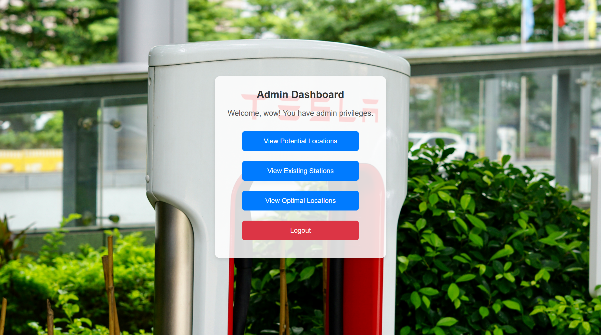

# EV Charging Station Location Optimization using Hybrid Gray Wolf and Genetic Algorithms

🧩 Project Features
🧠 AI-Based Optimization: Uses Gray Wolf Optimizer and Genetic Algorithm.

🗺️ Interactive Heatmaps: Visualize existing, potential, and optimal station locations.

🧍 Role-Based Access: Separate interfaces for users and administrators.

🔎 Nearest Station Locator: Find the closest charging station from your location.

## 🔧 Setup Instructions

To run the project, follow these steps in order:

1. **Start Combined API**  
   ```bash
   python combined_api.py
   ```

2. **Start Nearest Stations Script**  
   ```bash
   python nearest_stations.py
   ```

3. **Start Flask App**  
   ```bash
   python app.py
   ```

4. **Open pgAdmin**  
   - Launch pgAdmin from your system menu or terminal.

5. **Visit the Web App**  
   - Open your browser and go to:  
     [http://localhost:3000](http://localhost:3000)

---

## 📸 Screenshots

### 1. Register Page


### 2. Login Page


### 3. Admin Page


### 4. Service Page


### 5. Nearest Stations


### 6. Existing Heatmap


### 7. Potential Heatmap


### 8. Optimal Heatmap


---

## ✅ Notes

- Make sure PostgreSQL and pgAdmin are installed and properly configured.
- Ensure all dependencies in `requirements.txt` are installed:
  ```bash
  pip install -r requirements.txt
  ```
